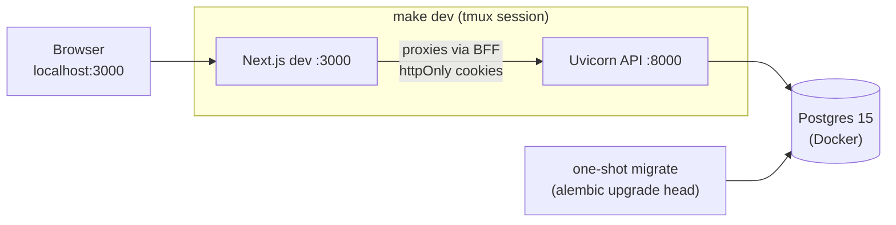
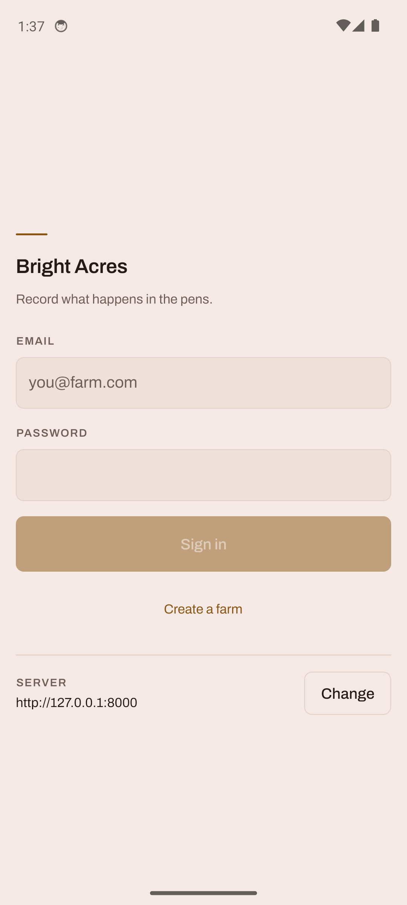
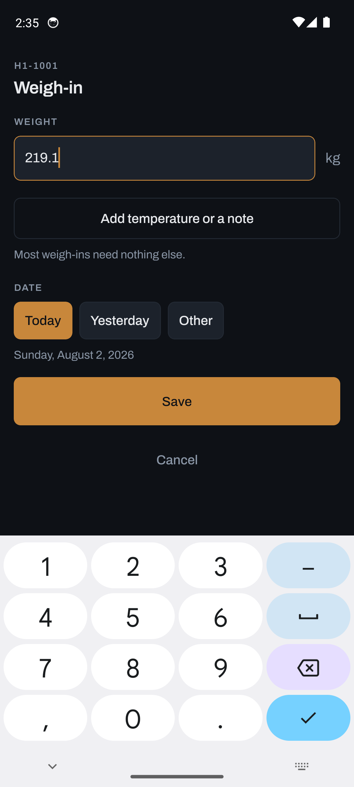
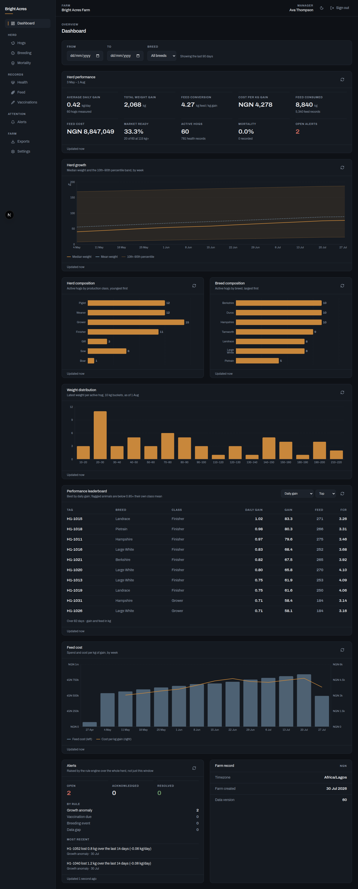
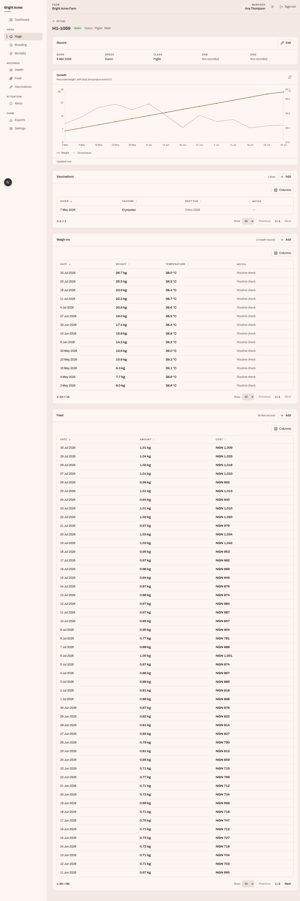
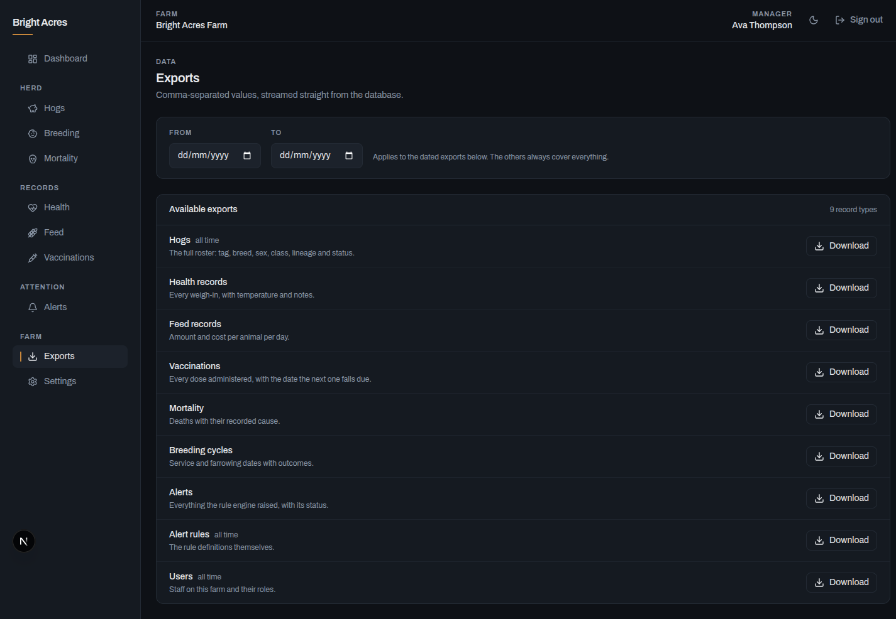

# Hog Farm Monitoring & Management System

A local-first pig-farm management system: individual-animal tracking (weight, breed, birth date,
tag number), production events (feed, health, breeding, alerts), and a KPI/growth dashboard.
Runs end to end on a single developer machine with no cloud services required.

| Layer | Stack |
|---|---|
| Web dashboard | Next.js 16 (App Router) + TypeScript + Tailwind v4 + TanStack Query + Recharts |
| API | Python 3.12 + FastAPI + SQLAlchemy 2.0 + Alembic |
| Database | PostgreSQL 15 via Docker Compose |
| Mobile | React Native + Expo (SDK 57) + expo-router + TypeScript — the field data-entry surface. Built and verified on a physical Android device (sideloaded dev-client/release build); Expo Go itself has not yet been tried on real hardware |

## Quick start

Everything is driven through the `Makefile`; `make help` lists every target.

```bash
cp .env.example .env        # then set JWT_SECRET (openssl rand -hex 32)
make install                # uv sync --all-groups + npm ci
make db-up && make migrate  # Postgres in Docker, schema via Alembic
make seed                   # demo farm: 1 boar, 2 sows, 3 growers, 14 piglets
make dev                    # tmux: API on :8000, dashboard on :3000, database logs, psql
```

Demo login: `manager@brightacres.com` / `Bright123!`

`make dev` is the everyday loop. It brings the database up, applies migrations, then opens a tmux
session with the API, the dashboard, `docker compose logs -f db`, a `psql` shell and a spare
prompt. Running it again attaches to the existing session rather than starting a second copy of
everything; `make dev-stop` tears it down and leaves the database container running. Without tmux,
`make api` and `make web` are the same two processes in two shells.

`DATABASE_URL` and `JWT_SECRET` are required and have no defaults — the API refuses to start
without them, rather than booting misconfigured and reporting healthy.



Other useful targets:

| Target | Does |
|---|---|
| `make dev` / `make dev-stop` | Start or stop the whole tmux dev session |
| `make psql` | Opens `psql` inside the container — no host client needed |
| `make seed-bulk` | 5 farms × 60 hogs × 90 days, ~27k feed rows, in about 12 seconds |
| `make db-reset` | Destructive: drops the volume, re-migrates, re-seeds |
| `make mobile` | Starts Expo (Metro on :8081) for the phone app — a separate shell from `make dev` |
| `make check` | Runs exactly what the quality gate runs — lint, typecheck, all three test suites |
| `make types` | Regenerates the dashboard's and the app's API types from the running backend's OpenAPI document |

## Tests

`make test` runs all three suites: **pytest** for the backend (93 tests, against a `hogfarm_test`
database on the same Postgres container), **Vitest + jsdom** for the dashboard (25 tests), and
**Vitest** in a plain node environment for the mobile app (92 tests) — 210 in total. Backend tests
skip rather than fail when Postgres is unreachable, so a stopped container does not look like a
broken build.

The mobile suite covers logic rather than screens, deliberately: nothing there renders a React
Native component, because everything that can be *silently* wrong in that app is pure logic — the
error extractor, the single-flight token refresh, decimal-string parsing, the sparkline geometry,
permission gating. A broken view is a blank screen you notice in seconds; a sparkline that divides
by zero is a wrong chart nobody questions.

## Documentation

| File | Contents |
|---|---|
| [`docs/start_here.md`](docs/start_here.md) | From-zero provisioning guide — OS setup, prerequisites, install, seed, and running the web dashboard and (optionally) the mobile app |
| [`docs/how_it_works_(non-technical).md`](docs/how_it_works_(non-technical).md) | What the app does, in plain language, covering both the dashboard and the phone app, with an FAQ |
| [`docs/how_it_works_(technical).md`](docs/how_it_works_(technical).md) | Architecture, data model, and design decisions across the backend, web dashboard and mobile app, with an FAQ |

## Screenshots

A barn-to-boardroom walkthrough — capture on the phone, insight on the dashboard:

| | |
|---|---|
|  Sign in from the barn (mobile, light) |  Record a weigh-in in two taps (mobile, dark) |
|  The weigh-in updates the herd KPIs live (web, dark) |  Drill into that animal's growth history (web, light) |
|  Export the evidence as CSV (web, dark) | |
